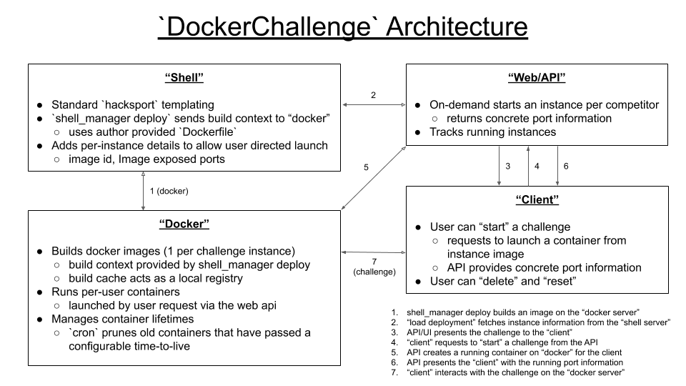
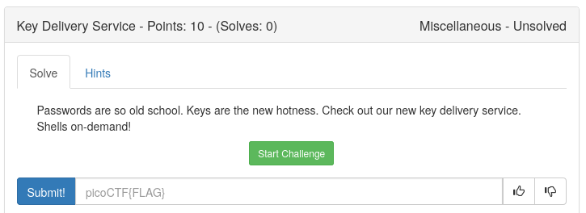
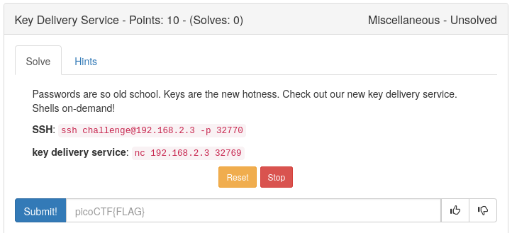

# On-Demand Challenges

**On-demand** challenges allow isolated, per-competitor, copies of a challenge
instance. This functionality is supported by the `DockerChallenge` class.

## Advantages

**Challenge isolation**. Every user gets a clean slate and their actions or
modifications will not impact other users. This enables stateful challenges
where a user can make modifications. It also allows more stable performance
characteristics as any given "on-demand" service only has a single user.
Importantly it prevents challenges from having unintentional lateral solutions.

**More complex constructions**. Since they are isolated per user the
`DockerChallenge` class allows arbitrarily complex challenge design, including
challenges with multiple related services.

**Greater development felxibility**. Anything that can be done in a container
a challenge authors can do without worrying about system wide conflicts.

**Challenge reset**. Every user can reset their on-demand challenges to a fresh
state. This can ease administration.

## Examples

The best way to learn how to use the `DockerChallenge` class is to consult the
provided [examples](../../problems/examples/on-demand/Readme.md)

## Architecture

The `DockerChallenge` class relies on access to a running `docker` daemon.  In
the development `Vagrantfile` this is configured to run on the shell server.
However in a production environment it can also be isolated to a separate
"docker server" with the daemon listening on a [TLS protected socket][dtls].
The provided `ansible` roles `docker` and `docker_tls` ensure that TLS is
appropriately configured in both cases. For clarity on the interface the
following diagrams show the "docker server" as a separate entity.

[dtls]:https://docs.docker.com/engine/security/https/

### DockerChallenge Lifetime

1. `shell_manager` deploy builds an image on the "docker server"
2. "load deployment" fetches instance information from the "shell server"
3. API/UI presents the challenge to the "client"
4. "client" requests to "start" a challenge from the API
5. API creates a running container on the "docker server" for the client
6. API presents the "client" with the running port information
7. "client" interacts with the challenge on the "docker server"

**Steps 1-3** are one time actions during challenge deployment similar to other
hacksport problem types. The only significant difference is that the
`DockerChallenge` class does not result in any service actually being started.

**Steps 4-7** are the "on-demand" functionality and can be repeated multiple times,
as a user desires.

The following screenshots show the user facing interaface for on-demand challenges.

#### Initial View (4)

#### Once Started (6)

## Limits

These limits are configurable, but by default a user is limited to running
3 on-demand challenges at a time and each on-demand challenge lasts for 1 hour.

## Configuration

The following variables can be used to configure the `ansible` deployment of the
platform. Consult  `ansible/group_vars/local_development` for an example

variable                    | description
----------------------------|--------------------
docker_public_host          | competitor facing hostname (or IP) used in challenge description
docker_internal_host        | connection URI to docker daemon
docker_server_SAN           | should include DNS and IP information for docker server
docker_ca                   | path to ca.pem
docker_client               | path to cert.pem
docker_key                  | path to key.pem
docker_ttl                  | time-to-live for a container
docker_containers_per_team  | number of concurrent on-demand instances

These are then templated into the API `deploy_settings.py` by the `pico-web`
role and `local_config.json` for `shell_manager` by the `pico-shell` role.
